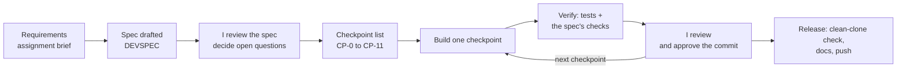

# Prompts and workflow

Beacon Lite was built with **spec-driven AI development (SDAD)**: the plan is written and reviewed
as a development spec first, the AI then builds it checkpoint by checkpoint, and each checkpoint is
verified and reviewed by me before the next one starts.

- **AI used:** Claude (Anthropic), working in the project folder: research, spec drafting, code,
  tests, running the app, documentation.
- **My requests** are written out clearly below, each with what it produced. The working sessions
  themselves were long and conversational, so these are the requests as they were meant, not a
  raw chat log.
- **The app's own prompts** (what the AI chat inside Beacon Lite is told) are in
  [`src/main/resources/prompts/`](src/main/resources/prompts/): `system.md` and the tool menu
  `tools.json`.
- The short reflection on how I used AI is in [`docs/AI_REFLECTION.md`](docs/AI_REFLECTION.md).

## The process



---

## 1. Spec

| My request | Result |
|---|---|
| Turn my planning notes into a development spec using my DEVSPEC template: goals, functional requirements with acceptance criteria, architecture, data model, API, implementation, an AI implementation guide with reversible checkpoints, and open questions with a proposed default for each. | [DEVSPEC](docs/DEVSPEC.md) v1.0: 23 functional requirements, data model, API, checkpoints CP-0 to CP-11 |
| Use free and open-source components only for the running app. | Spring Boot, H2, React, Ollama + Qwen2.5 7B (decision D6) |
| Don't assume anything: no invented numbers, every assumption visible and adjustable, and "Not checked" instead of a guess. | `config/assumptions.yml`, the Assumptions panel, "Not checked" states (D29) |
| Public pages only, robots.txt obeyed on every request, no cart or checkout tricks. | Polite fetcher and robots.txt rules (D27) |
| Before promising "any store", check what public data really exists on more stores. | Coverage verified on 16 stores; "any store" became "any standard Shopify store" (v1.1, Section 18.7) |

## 2. Review the spec

| My request | Result |
|---|---|
| I reviewed the open questions: accept the proposed defaults, and keep every value configurable. | All 25 open values decided; spec approved (v1.2) |
| Add coding standards that every change must follow. | [`docs/CODING_STANDARDS.md`](docs/CODING_STANDARDS.md) (v1.3) |
| No commit or push without my approval, and commits under my personal account only. | Repo-local git identity; every commit approved (D35) |

## 3. Build checkpoint by checkpoint

For each checkpoint my request was the same: **build CP-n as the spec describes, run its
verification checks, and show me the result before committing.** I reviewed each one before the
next started.

| Checkpoint | What it built | Verified by | Commit |
|---|---|---|---|
| CP-0 | Project skeleton, offline build | Offline build succeeds | `20d7797` |
| CP-1 | Core enums, error codes, Money | Unit tests | `768dd66` |
| CP-2 | Database schema (Liquibase) | Starts on H2; same schema on PostgreSQL; rollback tested | `7c1dd0d` |
| CP-3, CP-4 | Entities and repositories | Persistence tests incl. unique constraints | `dcbbdd1` |
| CP-5a–f | Polite fetching, robots.txt, URL guard; store adapters; snapshots, diff, jobs, scheduler; size parsing and insights; journey scorecard; AI chat | Tests on recorded real store data; 31 golden chat questions | `8bd2706` |
| CP-6, CP-6b | REST API, error handling; command-line scan and Insight Brief | A test for every endpoint; sample brief generated | `82c827c` |
| CP-7–9 | React dashboard | Contract test against the API; component tests | `ab4e7d9` |
| CP-10, CP-11 | Demo data, Docker, CI, docs; accuracy evidence | Demo runs offline; 5 of 5 live spot-checks matched | `b5350fd` |

When the spec changed during the build (for example, a demo store replaced because it shows a bot
check), the spec's change log was updated first (v1.4, v1.5).

## 4. Verify on real data

| My request | Result |
|---|---|
| Let me run it locally and check that the numbers are real and correct. | Ran in live and demo mode; numbers recounted from the raw data by a separate script |
| Show me how to run the six-hourly check by hand. | **Refresh now** runs the same check on demand |
| When I add a store, the progress screen should show the store I entered. | Fixed: the adding screen now names the store |

## 5. Product decisions

| My request | Result |
|---|---|
| A store's team shouldn't see other stores' data. For now this is a tool for Swym's team; in the merchant version, each store sees only its own data. Document it. | README "Who it's for"; spec v1.4 "Users and access" |

## 6. Design

| My request | Result |
|---|---|
| Make the UI attractive and clean, not busy: review it as a senior front-end developer would, with a clean gradient. Commit before this change so it can be undone. | New design tokens, icons, briefing card, KPI changes, size strips |
| Fix every overlapping text, without breaking anything else. | Layout check across 3 stores × 6 tabs × 3 widths; tooltips rebuilt |

## 7. Data and accuracy

| My request | Result |
|---|---|
| Copy the live snapshots into the demo, so reviewers see real history. | Demo replays 20 real snapshots from 3 to 8 Oct |
| Deep-check that everything is right. | Found and fixed a real bug: a check cut short by a stop was left half-saved |

## 8. Release

| My request | Result |
|---|---|
| A reviewer who clones the repo must be able to run it without issues. | Rebuilt and tested from a clean copy containing only the committed files |

---

## What we have now, and what production needs

Beacon Lite proves the loop on one machine. Each part sits behind an interface (`StoreAdapter`,
`SnapshotStore`, `LlmProvider`, `IntentSignalProvider`), so scaling means swapping implementations,
not rewriting the app. The production column is the planned design (see the
[development spec](docs/DEVSPEC.md), Section 16.3, and Part 2); none of it is built yet.

| Area | Now (Beacon Lite) | Production (50,000 stores) |
|---|---|---|
| **Store data** | Public catalog and pages, read politely | Shopify Admin API and webhooks, with the merchant's consent |
| **Demand signal** | Public stand-ins (best-seller collection, sell-out speed, full price…); $ is an estimate | Swym intent data (wishlist adds, back-in-stock sign-ups); $ becomes measured |
| **Stock** | In stock yes/no | Real quantities from the Admin API |
| **Freshness** | A check every 6 hours | Near real time from webhooks and event streams |
| **Users and access** | One user, runs locally, no login; any public store | Merchants log in through the Swym Shopify app and see only their own store; anonymous benchmarks |
| **Database** | H2 file (PostgreSQL-compatible schema) + compressed snapshot files | PostgreSQL with per-store row-level security; an analytics store for events; object storage for raw snapshots |
| **Scheduling** | In-app timer | Durable workflow scheduler with per-store rate limits |
| **AI model** | Local Qwen2.5 7B through Ollama | Small self-hosted model for most questions; a gateway escalates hard ones to a larger model |
| **AI quality control** | Number check, scope check, rule-based fallback, 31 golden questions | The same, plus tracing, merchant feedback and evaluation runs on every change |
| **Speed and cost** | Report computed per check | Answers pre-computed and cached per store; per-store cost budgets |
| **Rollout** | Run locally | Feature flags; staged rollout 10 → 100 → 1,000 → 50,000 stores with a kill switch |
| **Monitoring** | Logs, `/api/health`, `/api/metrics` | Metrics, traces and logs per store, with alerts |

How the AI answer flow works at that scale, and what can go wrong, is in
[Part 2 · Question to answer](docs/part2-question-to-answer.md).

---

## Final output: run it

Requires **Java 21**. The first build downloads its dependencies.

```bash
git clone https://github.com/MohammedAzharudeen/beacon-lite.git
cd beacon-lite
```

**Demo mode:** three recorded stores with 5 days of real history, no network needed.

```bash
./mvnw spring-boot:run -Dspring-boot.run.profiles=demo
```

**Live mode:** reads real stores; add any standard Shopify store from the top bar.

```bash
./mvnw spring-boot:run
```

Open <http://127.0.0.1:8080>. If port 8080 is taken, add `-Dspring-boot.run.arguments=--server.port=8099`.

**Command-line scan** (one store, writes a one-page Insight Brief to `reports/`):

```bash
./mvnw -DskipTests package
java -jar target/beacon.jar scan stevemadden.com
```

**Optional AI model** for the chat: install [Ollama](https://ollama.com) and run
`ollama pull qwen2.5:7b`. Without it, the chat uses its rule-based answers.
