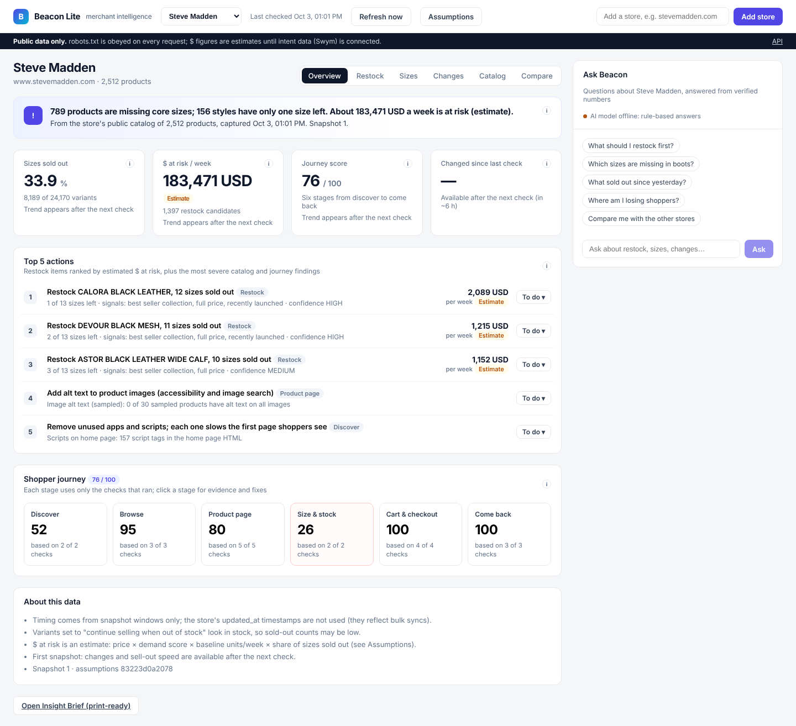
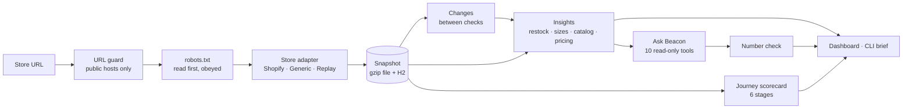

# Beacon Lite

Beacon Lite reads a store's **public** catalog and pages, finds where it is losing sales, ranks the
fixes by estimated $ at risk, and answers questions in plain English using only verified numbers.

Paste a store address → it reads `robots.txt` first, then the catalog and a few store pages, one
request at a time → you get a dashboard, a one-page Insight Brief and an "Ask Beacon" chat.



## What it found (real data, 3 Oct 2026)

| Store | Products | Sizes sold out | Products missing core sizes | Styles with one size left | Journey score |
|---|---:|---:|---:|---:|---:|
| Steve Madden | 2,512 | 33.9% | 789 | 156 | 76 |
| Reebok | 1,361 | 19.4% | 306 | 42 | 79 |
| Petal & Pup | 6,086 | 52.7% | 1,697 | 564 | 74 |

"Missing core sizes" = a middle size of the product's size run is sold out while other sizes are
still in stock. A sample brief generated from these recordings is in
[`reports/stevemadden-insight-brief.md`](reports/stevemadden-insight-brief.md).

## Who it's for

| | Who | What they can see |
|---|---|---|
| **This version** | Swym's team (sales, customer success) | Any public Shopify store: research a store before a conversation, show what it is losing and where Swym helps |
| **Merchant version** (planned) | A store's own team | Only their own store. Access comes from installing the Swym Shopify app (Shopify confirms ownership), so a merchant cannot add another store. Comparisons use anonymous benchmarks ("stores like yours"), never a named competitor's data |

The merchant version also replaces the estimated demand signals with Swym's measured intent data
(wishlist adds, back-in-stock sign-ups), so $ at risk stops being an estimate. This version has no
logins because it runs locally for one user; accounts and per-store access are the first step of the
merchant version.

## Run it

Requirements: **Java 21**. Node is downloaded by the build; no database to install.

```bash
# Offline demo: three recorded stores, no network needed
./mvnw spring-boot:run -Dspring-boot.run.profiles=demo

# Live: add any standard Shopify store from the dashboard
./mvnw spring-boot:run
```

Open <http://127.0.0.1:8080>. The app listens on 127.0.0.1 only. If another app already uses port
8080, start on a free port with `--server.port=8099` (or `SERVER_PORT=8099`). Use the `127.0.0.1`
address rather than `localhost`: a browser may send `localhost` to another app listening on the same
port over IPv6.

**AI chat (optional).** Install [Ollama](https://ollama.com) and run `ollama pull qwen2.5:7b`.
Without it, Ask Beacon answers with its rule-based router, so the chat always works.

**One-off scan from the command line:**

```bash
./mvnw -DskipTests package
java -jar target/beacon.jar scan stevemadden.com          # live
java -jar target/beacon.jar scan stevemadden.com \
  --offline src/main/resources/snapshots/www.stevemadden.com/2026-10-03T07-31-21Z.json.gz
```

It prints a summary and writes `reports/<store>-insight-brief.md` and a print-ready `.html`.

**Docker:** `docker compose up` starts the app and Ollama
(`docker compose exec ollama ollama pull qwen2.5:7b` once). Add `--profile postgres` and set
`SPRING_PROFILES_ACTIVE=live,postgres` in `.env` to use PostgreSQL instead of the embedded H2 database.

## How it works



- **Watcher.** A polite HTTP client (one request at a time per store, a pause between requests,
  retries with backoff, `Retry-After` honoured, size caps) behind an SSRF guard. Every path is
  checked against the store's `robots.txt`; blocked paths are never requested and show as
  "Not checked" with the rule that blocked them.
- **Snapshots** every 6 hours, written atomically. Changes are recorded as time windows between
  checks, so timing never comes from the store's own timestamps.
- **Restock priority = Demand × Gap × Value.** Demand comes from public stand-ins (best-seller
  collections, promotion, sell-out speed, full-price sell-through, recent launch). Gap weighs core
  sizes more than edge sizes. Pre-orders, back-orders, gift cards and bundles are listed separately,
  never dropped silently. **$ at risk is always labelled an estimate.**
- **Journey scorecard.** Six stages (Discover → Come back). Each stage scores only the checks that
  ran and shows its coverage ("based on 2 of 3 checks").
- **Ask Beacon.** The model picks one of 10 read-only tools; the server injects the store, runs the
  tool and checks that every number in the draft appears in the tool output. A draft that fails is
  replaced by a safe template answer. Questions public data can't answer (conversion rate, sales,
  units in stock, customers) get an honest refusal. Store text is treated as data, never as instructions.
- **Every number explained** in [`docs/HOW_IT_WORKS.md`](docs/HOW_IT_WORKS.md): data source, rule and
  formula for each card, signal and journey check.
- **Every judgment call** (core-size rule, exclusions, demand weights, thresholds) lives in
  [`config/assumptions.yml`](config/assumptions.yml). Its hash is stored with every report, so each
  number can be traced to a snapshot and an assumptions version.

## Store coverage

| Store type | Support |
|---|---|
| Standard Shopify storefronts | Full |
| Shopify catalogs above 25,000 products | Full, capped at the public feed limit and labelled partial |
| Headless Shopify (no public feed) | Clear "catalog not published" message |
| Other platforms with product JSON-LD | Sampled products, labelled "Sampled" |
| Stores that show a bot check | Clear "this store blocks automated tools" message; bot checks are never worked around |

## If you run a store Beacon Lite reads

Beacon Lite identifies itself as `BeaconLite/1.0 (+contact in README)`, reads only public pages,
obeys `robots.txt`, sends one request at a time with a pause in between, and never touches carts,
checkout or accounts. To ask a question or opt out, open an issue at
<https://github.com/MohammedAzharudeen/beacon-lite/issues>.

## Limitations

- Public data has no sales, traffic or stock quantities, so $ at risk is an estimate.
- Variants set to "continue selling when out of stock" look in stock, so sold-out counts can be low.
- Timing is only as precise as the snapshot interval.
- Content that only appears after JavaScript runs isn't seen; such checks are marked "Not verifiable".
- Search quality can't be tested where `robots.txt` blocks search.

## Development

```bash
./mvnw verify      # Java tests, frontend tests and build, formatting checks
```

| Path | What's there |
|---|---|
| `src/main/java/com/beacon/` | Backend, one package per feature (adapter, fetch, robots, snapshot, insight, journey, chat, web, cli…) |
| `frontend/` | React + TypeScript dashboard (Vite, Recharts, Vitest) |
| `config/assumptions.yml` | Every judgment call behind the numbers |
| `src/main/resources/snapshots/` | Recorded store snapshots (demo mode and tests) |
| `src/test/resources/fixtures/` | Real recorded store responses used by tests |
| `scripts/record-stores.py` | Records store responses with the same robots.txt rules as the app |
| `docs/` | [User guide](docs/USER_GUIDE.md), [how every number is calculated](docs/HOW_IT_WORKS.md), [accuracy checks](docs/ACCURACY.md) and [coding standards](docs/CODING_STANDARDS.md) |

API documentation: <http://127.0.0.1:8080/swagger-ui.html> while the app runs.

Built with Spring Boot 3.3, Java 21, H2 (PostgreSQL-compatible schema, Liquibase), jsoup, React 18,
TypeScript and Recharts. The AI runs locally with Ollama and Qwen2.5 7B (Apache 2.0); any
OpenAI-compatible endpoint works through configuration.
