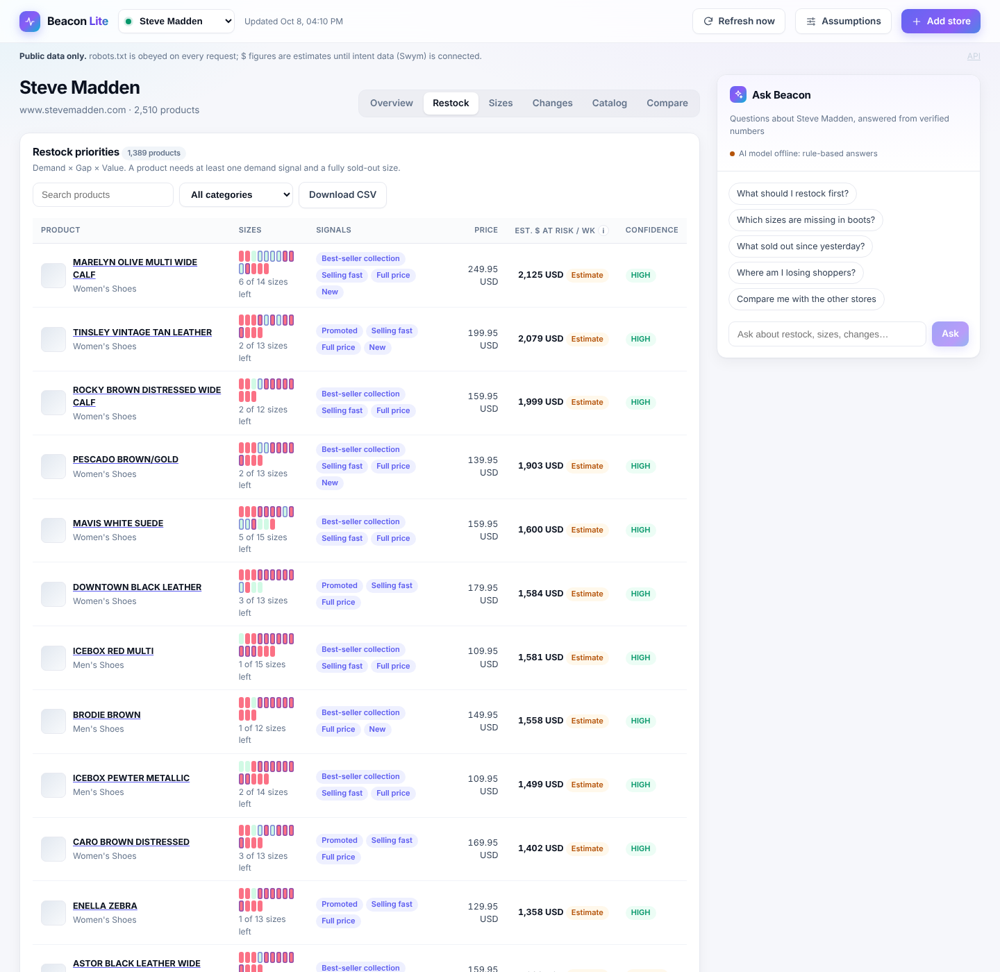
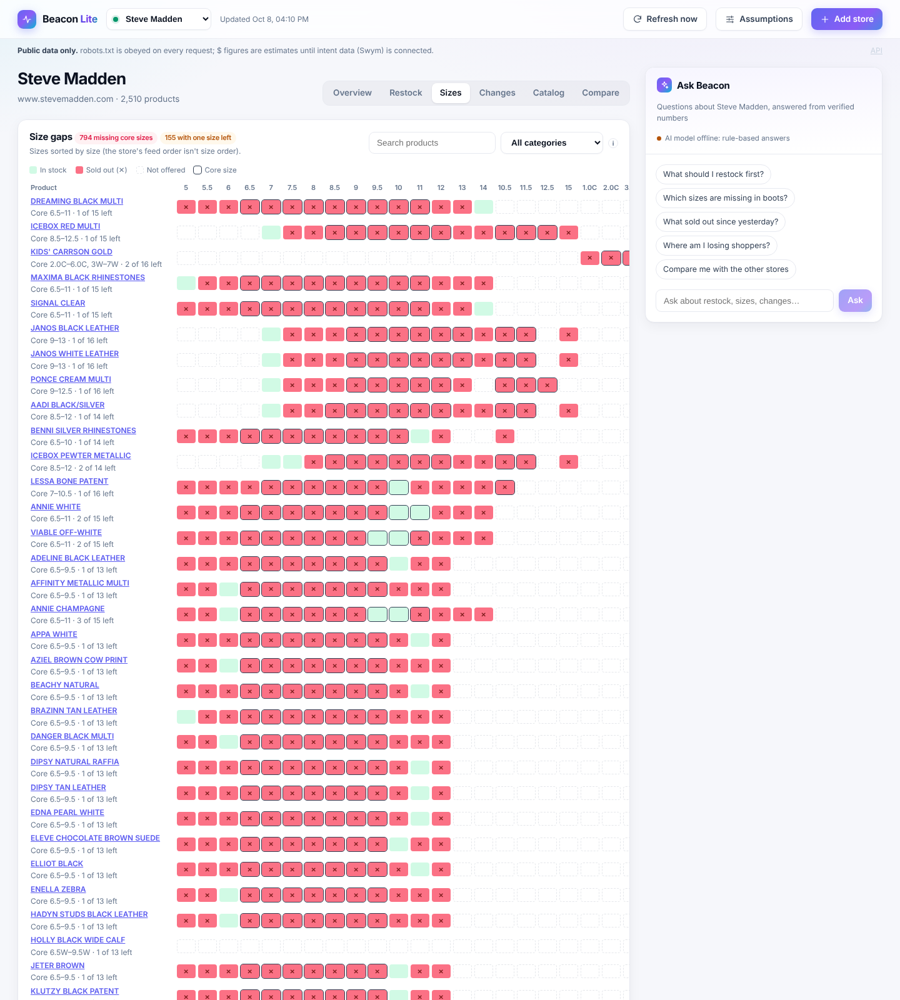
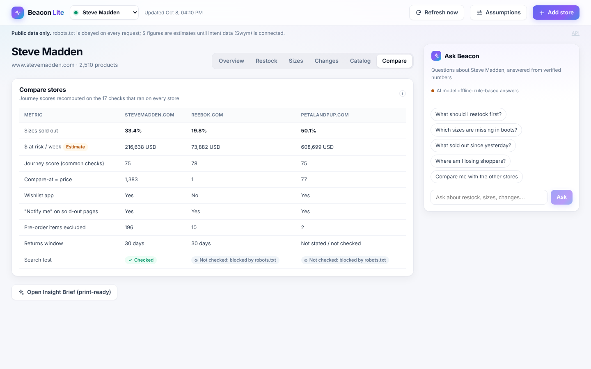
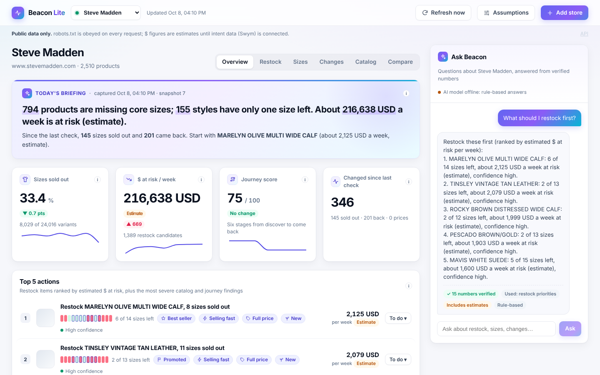
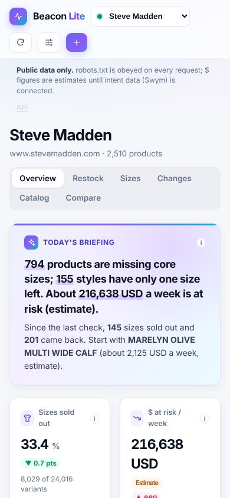

# User guide

Screens below show real data recorded from the demo stores in October 2026. Product photos load from
the stores' websites, so they appear as grey placeholders when the app runs offline.

## 1. Add a store

Type a store address in the top bar (for example `stevemadden.com`) and press **Add store**.
Beacon Lite checks the address, reads `robots.txt`, detects the platform and starts the first scan
in the background, showing each step:

1. Detected platform
2. Reading catalog (products read so far)
3. Checking store pages (home page, policy or footer pages, search where allowed, sold-out pages)
4. Building insights

Adding any store is part of this version, which is built for a super admin (internal team). In the merchant version a
store's team sees only their own store and cannot add others.

The store is re-checked every 6 hours (not in demo mode, which replays the recordings). **Refresh now** starts a check straight away; if one is
already running it joins it.

## 2. Overview

- **Headline**: the single most important finding.
- **Four key numbers**, each with an **i** button explaining what it means and how it's calculated.
  Estimates carry an **Estimate** badge. Trend lines appear after the second check.
- **Top 5 actions**: the three restock items with the most estimated $ at risk, plus the two most
  severe catalog or journey findings. Mark each one **Done** or **Dismiss**; dismissed actions leave
  the top 5 but stay in the full lists. Click an action to see its evidence.
- **Shopper journey**: six stages scored 0–100. Click a stage to see every check, its status
  (Checked, Checked via alternative page, Not checked: blocked by robots.txt, Not verifiable,
  Not available), the evidence and a suggested fix.

## 3. Restock

Every restock candidate ranked by estimated $ at risk per week, with a link to the live product
page, a size strip (red = sold out, outlined = core size), the demand signals used and a
confidence level. Search by name, filter by category, or **Download CSV** with the same columns.

Below the table, **Not restock candidates** lists items kept out of the ranking and why
(pre-order, back-order, gift cards and other non-stock items, bundles, likely discontinued).

## 4. Sizes

Products × sizes in true size order (stores often list sizes out of order). Green = in stock,
red ✕ = sold out, dashed = size not offered, outlined = core size. Regular and wide sizes, or adult
and kids sizes, are separate size runs with their own core range.

## 5. Changes, Catalog and Compare

- **Changes**: what sold out, came back or changed price between two checks, shown as a time window
  (for example "08:00 → 14:00"), never as an exact time.
- **Catalog**: products with few images, sampled image alt text, short descriptions, inconsistent
  product types, compare-at prices equal to the selling price, discount depth, dead stock and the
  free-shipping threshold against the median price.
- **Compare**: stores side by side. Journey scores are recomputed using only the checks that ran on
  every store, so a check blocked on one store doesn't skew the others.

## 6. Ask Beacon

Ask in plain English, for example "What should I restock first?" or "Which sizes are missing in
boots?". Each answer shows how many numbers were verified against the data, which tools were used,
and whether it includes estimates. Questions public data can't answer, such as conversion rate or
sales, get an honest "Public data can't show that" instead of a guess.

## 7. Assumptions and the Insight Brief

- **Assumptions** (top bar) lists every judgment call. Try different demand values and the restock
  list re-ranks instantly. To keep them, edit `config/assumptions.yml` and rescan.
- **Open Insight Brief** gives a one-page, print-ready summary: headline, evidence, what to do and
  expected impact. Use the browser's "Save as PDF" to share it.

## Works on a phone

