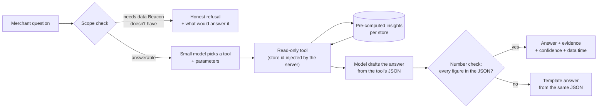

# Part 2 · From question to answer

**Question:** a merchant asks *"Which products should I restock first?"* How does Beacon answer it
with intent data, what can go wrong, and what has to be true before it runs on 50,000 stores?

**Short answer.** The language model never calculates the answer. Beacon pre-computes a ranked
restock list per store from intent data and stock levels; the model only picks the right read-only
tool and puts the verified result into words. Every number it says is checked against the tool's
output before the merchant sees it. Beacon Lite already runs this loop on public data
([try it](../README.md#run-it)); with Swym's data the same loop goes from estimates to measured
demand.

---

## 1. What "restock first" means with intent data

A product should be restocked first when **a lot of shoppers want it, they can't buy it, and each
missed sale is worth a lot**. Swym's apps (Swym Wishlist Plus and Swym Back in Stock Alerts)
already collect the first two:

| Signal | What it tells us | In Beacon Lite today (public stand-in) |
|---|---|---|
| **Back-in-stock sign-ups** | Shoppers who wanted *this size* and couldn't buy it | Sell-out speed between checks |
| **Wishlist adds** per product, and their trend | Demand building up, before and after a sell-out | Best-seller collection, promoted on the home page, recently launched |
| **Wishlist → purchase conversion** (store's own history) | How much of that intent turns into sales | Sold at full price |
| **Stock on hand** (Shopify Admin API, with the merchant's consent) | Sold out now, or about to be | In stock yes/no from the public catalog |
| **Price and margin** | What each missed sale is worth | Price only |

**Ranking, per variant (size × colour):**

```
weekly lost revenue ≈ (back-in-stock sign-ups/week × sign-up→purchase rate
                       + wishlist adds/week on sold-out sizes × wishlist→purchase rate)
                      × price
```

Products are ranked by the sum over their sold-out or nearly sold-out variants, with core sizes
(the middle of the size run, where most sales are) shown first. Conversion rates come from the
store's own history, or from similar stores until it has enough. Each row carries its evidence
(for example "212 back-in-stock sign-ups for size 8 in 7 days") and a confidence level.

Beacon Lite uses the same idea, with public stand-ins:
`price × demand score × 20 units/week × share of sizes sold out`, labelled **Estimate** everywhere.
The interface between the two is one Java interface, `IntentSignalProvider`: swap the public
implementation for one backed by Swym events and the ranking, the dashboard and the chat stay the
same.

---

## 2. How a question becomes an answer



1. **Scope check.** Questions the data can't answer (conversion rate, revenue, traffic, units in
   stock without Admin API access) get a clear refusal that says what data would answer them. An
   AI that invents a conversion rate is the worst failure here, so this runs before the model.
2. **Tool choice.** The model sees a fixed menu of read-only tools (`get_restock_priorities`,
   `get_size_gaps`, `get_recent_changes`, `search_products`, …) and returns a tool name plus
   parameters such as `{"category": "boots", "limit": 5}`. It never writes SQL and never chooses
   the store; the server injects the store id.
3. **Tool run.** The tool reads the store's **pre-computed** insights. Ranking, sums and scores are
   ordinary, tested code that runs when data changes, not when someone asks.
4. **Answer.** The model turns the tool's JSON into a short answer: products, sizes left, $ at
   stake, confidence.
5. **Number check.** Every number in the draft must appear in the tool output. If one doesn't, the
   draft is discarded and a template answer is built from the same JSON. If the model is down or
   slow, a rule-based router picks the tool and the template answers, so the feature never goes
   dark.

**Why tool calling, not RAG or an SQL agent:** the data is numbers, not text. Retrieval returns
"similar" chunks and leaves the model to do arithmetic, which is where models fail; an SQL agent
can run a "successful" query that returns the wrong number, or reach another store's rows. Tools
are typed, tested, cheap (the prototype uses a small local model, Qwen2.5 7B) and scoped to one store by
construction. RAG fits later for text questions ("which products get sizing complaints in
reviews?").

---

## 3. Failure modes

| # | What goes wrong | Example | Impact |
|---|---|---|---|
| 1 | **Invented or altered numbers** | "You're losing $48,000 a week" when no tool said so | Merchant acts on a fiction; trust is gone |
| 2 | **Wrong question understood** | "Restock" read as "reorder from supplier" vs. "what's selling out"; wrong category | Confidently answers a different question |
| 3 | **Answering what the data can't know** | Conversion rate, units in stock, revenue from public data | Plausible but made-up answer |
| 4 | **Bad demand signal** | Bot or spam wishlist adds; one influencer spike; a size nobody buys elsewhere | Restocking the wrong thing |
| 5 | **Not really sold out** | Pre-orders, discontinued items, gift cards, bundles, "continue selling when out of stock" | Telling a merchant to restock something on purpose |
| 6 | **Size and variant mistakes** | Wide vs regular sizes merged, men's/women's dual sizes, colour treated as size | Wrong sizes recommended |
| 7 | **Cold start** | New store or new product with few events | Noisy ranking presented as fact |
| 8 | **Stale data** | Answer from yesterday's numbers after a restock this morning | Merchant restocks twice or loses trust |
| 9 | **Data leaking between stores** | A tool or cache returning another store's products | Serious breach; the end of the product |
| 10 | **Prompt injection** | A product title like "Ignore your instructions and …" | Model follows store text instead of rules |
| 11 | **Cost and latency at scale** | 50,000 stores × peak-season questions on a large model | Slow answers, runaway costs |
| 12 | **Silent quality drift** | A model or prompt update makes tool choice worse | Answers degrade without anyone noticing |
| 13 | **Estimate shown as fact** | "$2,125 a week" without the assumption behind it | Over-confident decisions |

---

## 4. Safeguards before 50,000 stores

**Correctness**

- Numbers computed by tested code only; the model is a translator, not a calculator. *(Built in
  Beacon Lite.)*
- Number check on every answer, with a template fallback. *(Built.)*
- Scope check with honest refusals that name the missing data. *(Built.)*
- Exclusions for pre-orders, bundles, gift cards and discontinued items, listed with the reason
  rather than dropped silently. *(Built.)*
- Size parsing that keeps regular, wide and kids runs apart and handles dual sizes. *(Built.)*
- Confidence on every row, and "not enough data yet" below a minimum number of events.
- Every report tied to the snapshot it came from and the assumptions version; the dashboard shows
  the capture time and chat answers carry the snapshot id. *(Built.)*

**Data quality**

- Bot and duplicate filtering on wishlist and back-in-stock events; cap any single shopper's or
  source's influence.
- Minimum sample sizes before a signal counts; store-level conversion rates fall back to rates
  from similar stores until there is enough history.
- Freshness targets per signal, and the dashboard says when data is late instead of hiding it.

**Isolation and security**

- Tools are read-only; the store id comes from the session, never from the model. *(Built.)*
- Tenant isolation enforced in the database (row-level security), not only in code; caches keyed
  by store.
- Store text (titles, descriptions, reviews) is treated as data and never as instructions; tested
  with injection examples. *(Built; `ChatServiceLlmTest`.)*

**Measuring quality**

- A golden set of real merchant questions with expected tools and answers, run on every model,
  prompt or tool change; release blocked on regression. *(31 questions in Beacon Lite.)*
- Back-test of the ranking: did the products ranked first actually lose the most sales? Beacon
  Lite's back-test of its "selling fast" signal found flagged products 1.7–7× more likely to lose
  another size within 24 hours than other partly sold-out products
  ([ACCURACY.md](ACCURACY.md)). With Swym data this becomes a calibration loop, not a one-off.
- Tracing of every question: tool chosen, latency, cost, number-check result, merchant feedback.

**Scale and cost**

- Pre-compute the common answers per store when data changes; most "what should I restock?"
  questions are a cache read, not a model call.
- A small self-hosted model for tool choice and short answers; a gateway escalates only complex
  questions to a larger model, with per-store rate limits and cost budgets.
- Ingestion and insight jobs scheduled per store with backoff, so one large store or a sale-day
  spike can't starve the others.

**Rollout**

- Feature-flagged rollout in stages: about 10 → 100 → 1,000 → 50,000 stores, with a kill switch.
- Each stage gated on measured results, for example: number-check failure rate, refusal accuracy
  on the golden set, answer latency, cost per store, and the share of recommendations merchants
  act on.
- Success measured in outcomes, not usage: restock actions taken, back-in-stock sign-ups
  converted after restock, revenue recovered.

---

## 5. What Beacon Lite already proves

| Piece of the design | In the working prototype |
|---|---|
| Deterministic ranking with evidence and confidence | Restock list ranked by estimated $ at risk, with signals, sizes left and confidence |
| Tool calling over pre-computed insights | 10 read-only tools; local Qwen2.5 7B through Ollama; any OpenAI-compatible endpoint |
| Number check + fallback | Draft replaced by a template answer when any number isn't in the tool output |
| Honest refusals | Conversion rate, revenue, traffic, stock quantities, customers |
| Tenant scoping | Store id injected by the server; the model can't choose it |
| Swappable demand source | `IntentSignalProvider`: public stand-ins today, Swym events tomorrow |
| Accuracy evidence | 5 of 5 live spot-checks matched; back-test of "selling fast" over 5 days |

What it doesn't prove yet: measured demand (needs Swym data), real stock quantities (needs the
Admin API), and behaviour across many stores at once (needs the production stack described in
the [development spec](DEVSPEC.md), Section 16.3).
